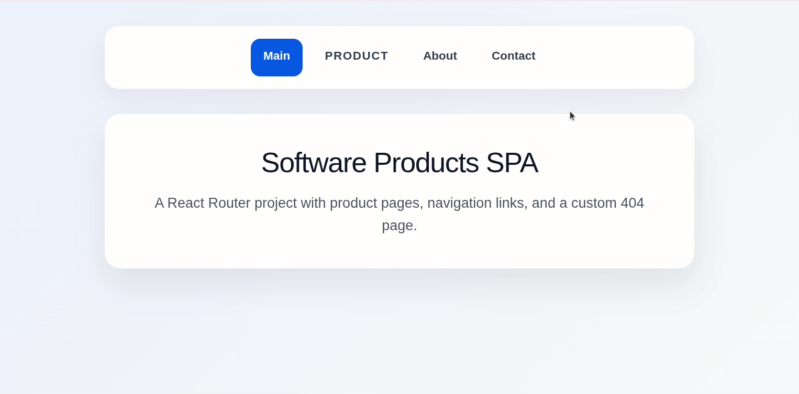

# Software Products SPA

A responsive React single-page application built with React Router. The project demonstrates client-side routing, active navigation links, product subpages, a Radix UI dropdown menu, a mobile burger menu, and a custom 404 page.



## Features
- Client-side routing with React Router
- Navigation between pages using `Link` and `NavLink`
- Active navigation state for the current page
- Product dropdown menu built with Radix UI
- Mobile burger menu with a product submenu
- Product section with links to Software and Operating Systems pages
- Custom 404 page for unknown routes
- Responsive layout for desktop and mobile screens

## Tech Stack
- React
- Vite
- React Router
- Radix UI Dropdown Menu
- JavaScript
- CSS

## What I Used
- `BrowserRouter` to wrap the application and enable routing
- `Routes` and `Route` to define application pages
- `Link` for navigation links inside pages
- `NavLink` for navigation links with active styling
- `useLocation` to detect when the user is inside the Product section
- `useState` to control the mobile burger menu and mobile product submenu
- Radix UI Dropdown Menu for the desktop Product dropdown
- CSS media queries for responsive design

## Pages and Routes
| Page | Route |
| --- | --- |
| Main | `/` |
| Products | `/product` |
| Software | `/product/software` |
| Operating Systems | `/product/os` |
| About | `/about` |
| Contact | `/contact` |
| 404 Page | `*` |

## What I Learned
While building this project, I practiced creating a React SPA with multiple pages and client-side routing. I learned how to use `NavLink` to highlight the active page, how to organize nested product pages, and how to create a custom 404 page.

I also practiced using `useLocation` to highlight the Product navigation button when the user is on any product-related route, such as `/product`, `/product/software`, or `/product/os`.

For the responsive navigation, I used `useState` to open and close the mobile burger menu and mobile product submenu. I also used Radix UI Dropdown Menu to create an accessible desktop dropdown for the Product section.

## Getting Started
### 1. Clone the repository
```bash
git clone https://github.com/antonina-kachusova/Software-Products-SPA-REACT-Router-Link-NavLink.git
cd software-products-spa
```

### 2. Install dependencies
```bash
npm install
```

### 3. Run the project locally
```bash
npm run dev
```

### 4. Build for production
```bash
npm run build
```

### 5. Preview production build
```bash
npm run preview
```

## Scripts
```bash
npm run dev       # Start the development server
npm run build     # Build the project for production
npm run lint      # Run ESLint
npm run preview   # Preview the production build locally
```

## Project Structure
```text
software-products-spa/
├── demo/
│   └── demo.gif
├── public/
│   ├── normalize.css
│   └── skeleton.css
├── src/
│   ├── About.jsx
│   ├── App.css
│   ├── App.jsx
│   ├── Contact.jsx
│   ├── Main.jsx
│   ├── Nav.jsx
│   ├── OperationSystem.jsx
│   ├── Page404.jsx
│   ├── Product.jsx
│   ├── Software.jsx
│   ├── index.css
│   └── index.jsx
├── .gitignore
├── eslint.config.js
├── index.html
├── package.json
├── package-lock.json
└── vite.config.js
```

## Notes
This project was created as a React Router practice project and then improved for portfolio use. It focuses on routing, navigation, dropdown behavior, responsive menu logic, and clean page structure.
